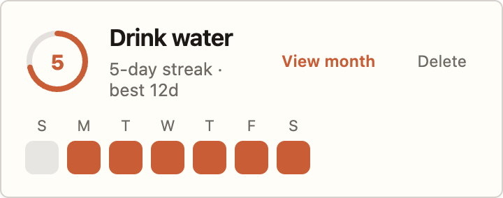
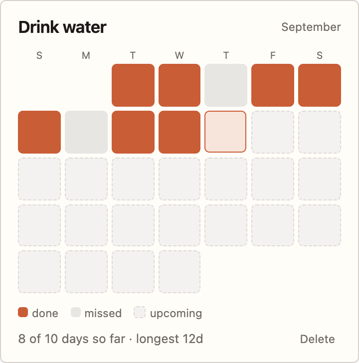

# 2a — Ring + week strip: implementation plan

Target: `J-reyes/habit-tracker@main`. Scope is `HabitItem` plus two small helpers; `App.tsx`, `HabitList.tsx`, and `useLocalStorage.ts` stay as they are.

## 1. `src/lib/date.ts` — add date helpers

Existing `toISO` / `previousDayISO` stay. Add:

- `lastNDaysISO(n: number, today: string): string[]` — ISO days oldest→newest, ending at `today` (used by the week strip).
- `monthGridISO(today: string): (string | null)[]` — full current month, padded with `null` for leading blanks so the grid starts on Sunday.
- `weekdayInitials(): string[]` — `["S","M","T","W","T","F","S"]`, single source for both headers.

No change to `streak.ts`; `currentStreak` / `longestStreak` already give the label numbers.

## 2. `src/components/HabitItem/HabitItem.tsx` — restructure

Props unchanged (`habit`, `today`, `streak`, `longestStreak`, `onDeleteHabit`, `onToggleToday`), so `HabitList` needs no edits.

Local state: `const [view, setView] = useState<"week" | "month">("week")`.

Derived values:
- `done = habit.completedDates.includes(today)`
- `ringFraction = Math.min(streak, 7) / 7` → `strokeDashoffset = C * (1 - ringFraction)`, `C = 2π * 20 ≈ 125.66`
- `weekDays = lastNDaysISO(7, today)`
- `monthDays = monthGridISO(today)`
- per-day status: `done` (in `completedDates`) · `missed` (past, not in set) · `upcoming` (ISO > today) · `today`

Markup:
- **Header row** (always): ring button (week view only) · title + `{streak}-day streak · best {longestStreak}d` · `View month` / `View week` text button · `Delete` text button.
- **Week view**: weekday initials row + 7 day cells aligned to the same 24px track.
- **Month view**: ring hidden, 7-column grid of all month days + done/missed/upcoming legend + `{doneSoFar} of {daysElapsed} days so far · longest {longestStreak}d`.

The ring **is** today's toggle — `onClick={() => onToggleToday(habit.id)}`. Day cells are display-only in v1 (backfilling past days is a separate change).

## 3. `HabitItem.module.css` — replace the grid-areas layout

- Drop `grid-template-areas`; card becomes `display:flex; flex-direction:column; gap:0.75rem`, header row a flex row with `gap:0.9rem`. Keep the existing `padding`, `background:var(--card)`, `border:1px solid hsl(var(--line))`, `var(--radius)`, and box-shadow so it still matches the rest of the app.
- `.ring` 46px button, `background:none`, `.ringTrack` stroke `hsl(30 10% 88%)`, `.ringFill` stroke `hsl(var(--violet))`, `transition: stroke-dashoffset .4s ease`.
- `.day` 24px / `.monthDay` `aspect-ratio:1`, radius 5–6px, with modifiers `.done` (`hsl(var(--violet))`), `.missed` (`hsl(30 10% 90%)`), `.upcoming` (`hsl(30 10% 95%)` + dashed border), `.today` (violet outline).
- `.delete` keeps the current hover treatment from `.remove`; `.viewToggle` is the same text-button but violet.
- The old `.toggle` (checkbox) and `.stat` pill rules are removed.

## 4. Day-7 behavior (3c, chips removed)

`ringFraction` caps at 7 days, so on the 7th consecutive day the ring reads full, plays one `pulse` keyframe, then naturally reads day 1 of the next seven as the streak continues. Nothing is archived and `currentStreak` keeps counting, so the label is the long-term record.

## 5. Accessibility

- Ring: `<button type="button" aria-pressed={done} aria-label={...}` — replaces the checkbox, so keep a visible `:focus-visible` outline.
- View toggle: `aria-expanded={view === "month"}`.
- Day cells: `aria-hidden` on the swatch grid + a visually-hidden text summary; `title`/`aria-label` per cell with the date and status.
- Wrap the ring transition and pulse in `@media (prefers-reduced-motion: reduce)` (the Header module already sets this precedent).

## 6. Check before merge

Toggle today on/off (ring fill, count, label, today's cell) · streak of 7+ (ring full, pulse, no overflow) · empty habit (0d, empty strip) · month boundary (`monthGridISO` padding, first of month) · week/month toggle preserves state · keyboard-only pass · mobile width (card reflows, 44px hit target on the ring).

**Suggested order:** helpers + tests → `HabitItem.tsx` week view → CSS module → month view → a11y/reduced-motion pass.

## 7. Visual reference

Week view (default) — ring is today's toggle:

Month view (expanded) — ring hidden, all days of the month, future days grayed:

## 8. Exact style values

All colors already exist in `src/index.css`; nothing new is introduced except one track gray.

| Token | Value | Used for |
|---|---|---|
| `hsl(var(--violet))` | `hsl(16 58% 50%)` | ring fill, completed day cells, view-toggle text |
| ring track | `hsl(30 10% 88%)` | unfilled ring arc |
| missed day | `hsl(30 10% 90%)` | past day not completed |
| upcoming day | `hsl(30 10% 95%)` + `1px dashed hsl(30 10% 85%)` | day not yet reached |
| today (month view) | `hsl(var(--violet) / 0.15)` + `1.5px solid hsl(var(--violet))` | today's cell |
| `var(--card)` / `hsl(var(--line))` / `var(--radius)` | unchanged | card surface, border, 6px radius |
| `var(--muted)` `#6f6a64` | unchanged | label, weekday initials, legend, Delete |

**Card:** padding `1rem 1.05rem`, `border-radius: var(--radius)`, `border: 1px solid hsl(var(--line))`, `box-shadow: 0 8px 22px hsl(30 12% 20% / 0.05)`, column flex, `gap: 0.75rem` — same shell as today's card.

**Header row:** flex, `align-items: center`, `gap: 0.9rem`; ring → title block (flex 1) → `View month` → `Delete`.

**Ring:** 46×46 button, SVG `viewBox="0 0 46 46"`, `circle r=20 cx=23 cy=23`, `stroke-width: 4`, `stroke-linecap: round`, group rotated `-90deg`; `stroke-dasharray: 125.66`, `stroke-dashoffset: 125.66 * (1 - streak/7)`, `transition: stroke-dashoffset .4s ease`. Inner counter: 36px circle, `var(--card)` fill, `font-size: 15px`, `font-weight: 800`, violet.

**Title:** `1.05rem / 650 / -0.02em`, `var(--text)`. **Label:** `0.78rem`, `var(--muted)`, format `{streak}-day streak · best {longest}d`.

**Week strip:** weekday initials row `0.68rem` in the same 24px track as the cells; cells `24×24`, `border-radius: 6px`, `gap: 6px`; today's cell `transition: background .25s ease`.

**Month grid:** `display: grid; grid-template-columns: repeat(7, 1fr); gap: 4px`; headers `0.62rem`; cells `aspect-ratio: 1`, `border-radius: 5px`; leading blanks are empty grid cells. Legend below at `0.7rem` with 10px swatches; summary line `0.78rem` reads `{done} of {elapsed} days so far · longest {longest}d`.

**Buttons:** `View month` / `View week` `0.72rem / 600`, violet, transparent background; `Delete` `0.72rem`, `var(--muted)`, keeps the existing `.remove:hover` treatment (violet text, `hsl(var(--violet) / 0.25)` border, `hsl(var(--violet) / 0.06)` background).

The live, clickable reference is `HabitItem Improvements.dc.html` → option **2a**.
